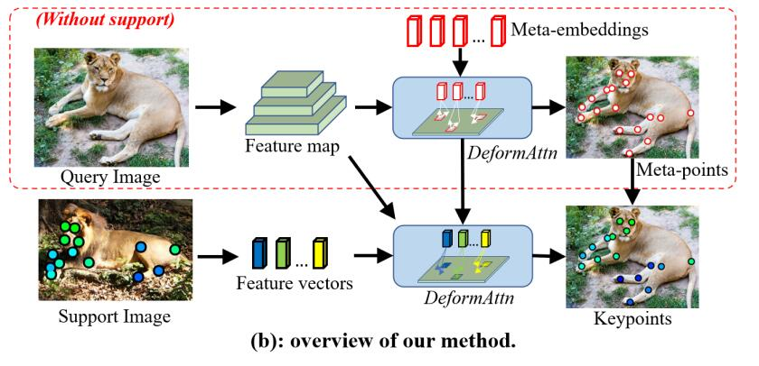

# MetaPoint (CVPR'2024)

Official code repository for the paper:  
[**Meta-Point Learning and Refining for Category-Agnostic Pose Estimation**](https://openaccess.thecvf.com/content/CVPR2024/papers/Chen_Meta-Point_Learning_and_Refining_for_Category-Agnostic_Pose_Estimation_CVPR_2024_paper.pdf)  
[Junjie Chen, Jiebin Yan, Yuming Fang, Li Niu] 

<div align="center">
  
</div>

### Abstract

Category-agnostic pose estimation (CAPE) aims to predict keypoints for arbitrary classes given a few support images annotated with keypoints. Existing methods only rely on the features extracted at support keypoints to predict or refine the keypoints on query image, but a few support feature vectors are local and inadequate for CAPE. Considering that human can quickly perceive potential keypoints of arbitrary objects, we propose a novel framework for CAPE based on such potential keypoints (named as meta-points). Specifically, we maintain learnable embeddings to capture inherent information of various keypoints, which interact with image feature maps to produce meta-points without any support. The produced meta-points could serve as meaningful potential keypoints for CAPE. Due to the inevitable gap between inherency and annotation, we finally utilize the identities and details offered by support keypoints to assign and refine meta-points to desired keypoints in query image. In addition, we propose a progressive deformable point decoder and a slacked regression loss for better prediction and supervision. Our novel framework not only reveals the inherency of keypoints but also outperforms existing methods of CAPE. Comprehensive experiments and in-depth studies on large-scale MP-100 dataset demonstrate the effectiveness of our framework.

## Usage

### Install
The installation is similar to [CapeFormer](https://github.com/flyinglynx/CapeFormer), detailed packages could be found in `cape_environment.yml`.

### Data preparation
Please follow the [official guide](https://github.com/luminxu/Pose-for-Everything) to prepare the MP-100 dataset for training and evaluation, and organize the data structure properly. 

Alternatively, we employ an unified annotation file (i.e., `unified_ann_file.json`) and adopt valid_class_ids to set various splits.

### Training and Test

The scripts are similar to [CapeFormer](https://github.com/flyinglynx/CapeFormer), and detailed scripts could be found in `scripts.sh`.
Pretrained weights (e.g., mAP: 77.4%) are available at [ejz3](https://pan.quark.cn/s/e4c36f7da0ff).


## Citation
```bibtex
@inproceedings{chen2024meta,
  title={Meta-Point Learning and Refining for Category-Agnostic Pose Estimation},
  author={Chen, Junjie and Yan, Jiebin and Fang, Yuming and Niu, Li},
  booktitle={Proceedings of the IEEE/CVF Conference on Computer Vision and Pattern Recognition},
  pages={23534--23543},
  year={2024}
}
```

## Acknowledgement

Thanks to:

- [MMPose](https://github.com/open-mmlab/mmpose)
- [Pose-for-Everything](https://github.com/luminxu/Pose-for-Everything)
- [CapeFormer](https://github.com/flyinglynx/CapeFormer)

## License

This project is released under the [Apache 2.0 license](LICENSE).
